# Operationalizing Machine Learning  | Azure ML Studio

In this project, we are going through the all the processes that are needed to deploy our machine learning model on Azure for the end users. Though, this repository is useful to create Ml-Ops Pipeline for organisations.

## Architectural Diagram
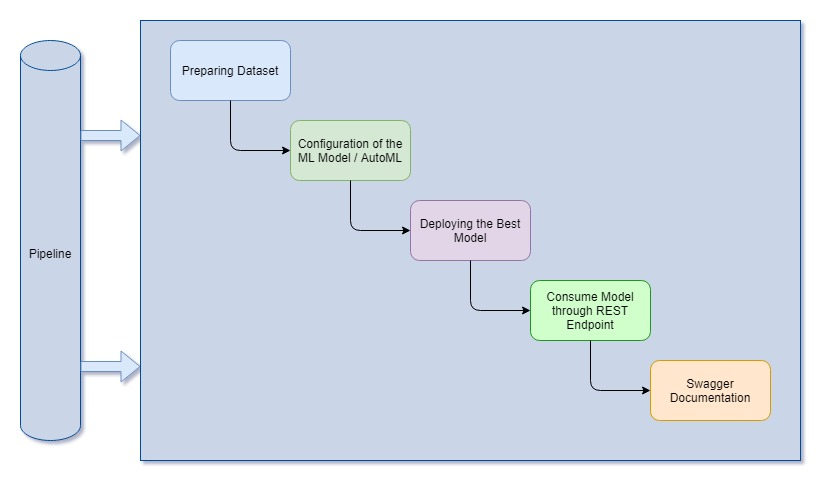

*TODO*: Provide an architectual diagram of the project and give an introduction of each step. An architectural diagram is an image that helps visualize the flow of operations from start to finish. In this case, it has to be related to the completed project, with its various stages that are critical to the overall flow. For example, one stage for managing models could be "using Automated ML to determine the best model". 

## Key Steps
The key steps are as follows.
1. Model Configuration & Training
    
    To operationalize the ML model for end users, first we should have our prepared dataset and model configuration for that dataset should be ready which is **Bank marketing** dataset in our case.
    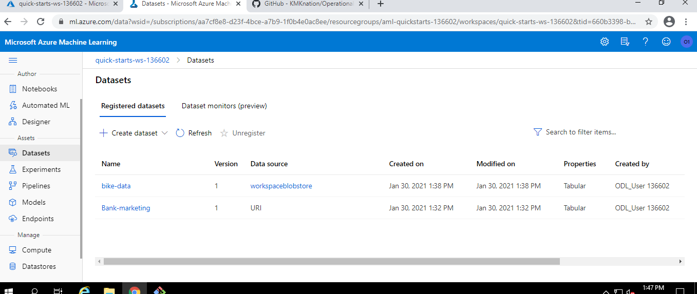
    
    After the model configuration, we have to start the experiment and wait for the experiment to get complete.
    
    After the successfuly run of the experiment, we would have the best model. In our case it is **Voting Classifier**.
    
    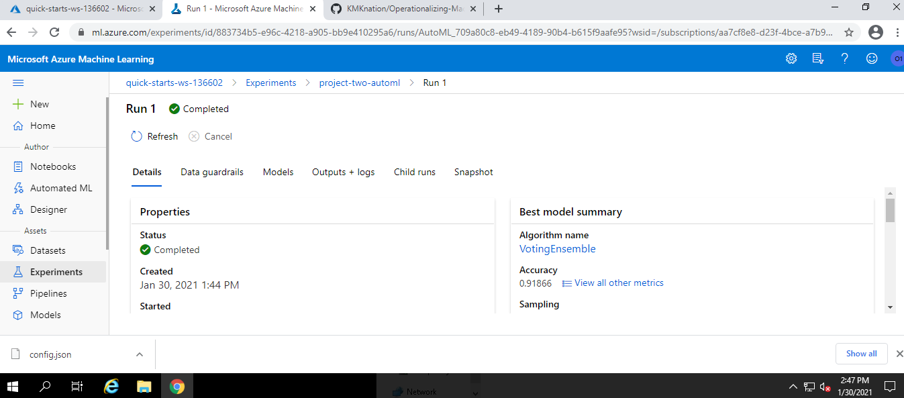
    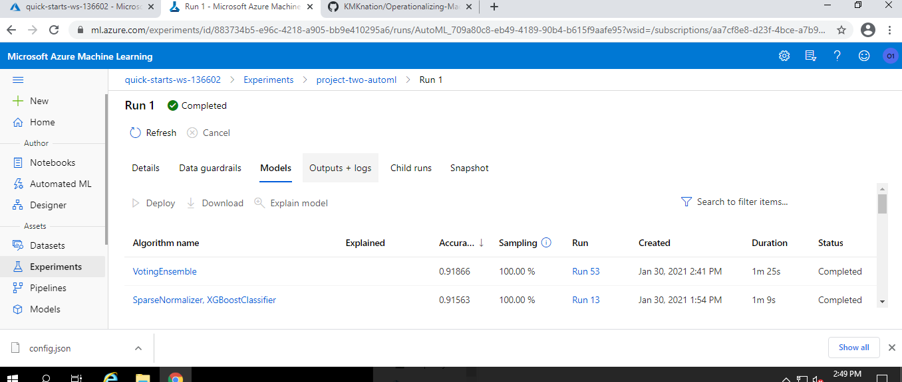
    
2. Deployment
    
    After getting the best model, now we are good to go for the deployment of the best model. We can deploy the model by clicking the **Deploy** button given in model details.
    
    When the deployment gets successfull, we can see our Rest API endpoint under the endpoints section of Azure ML Studio.
    
    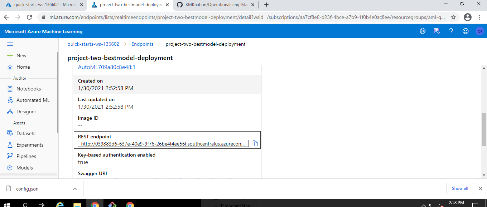
    
3. Consume
    
    Completing the above deployment process, we have our endpoint ready to consume. But before that there are some checklist we need to follow to ensure the stability of the endpoint.
    
    To do that we have following checklist.
    - Enable Logs
      
      This step is need to check whether our enpoint gets successfulyy deployed or not.  
      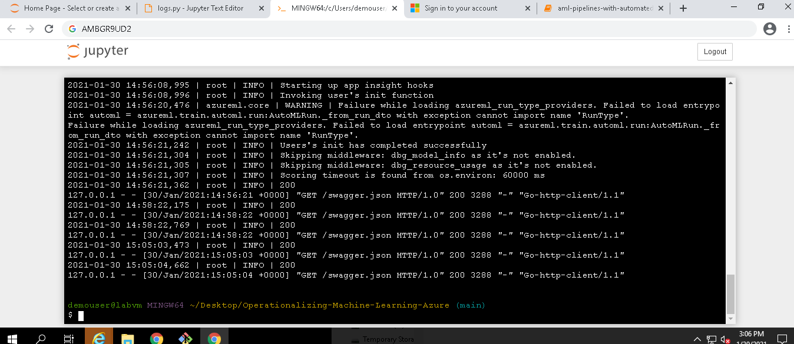
      
      After enabling the log, we will able to see the insight url in ML Studio.
      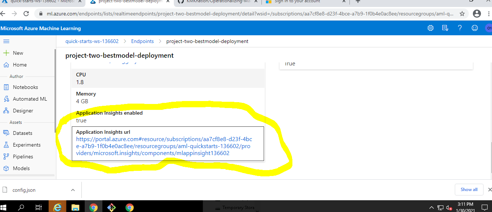
      
    - Make rest call to endpoint
      
      When we make an API call to our endpoint with sample data, we are able to see the inference output of the model.      
      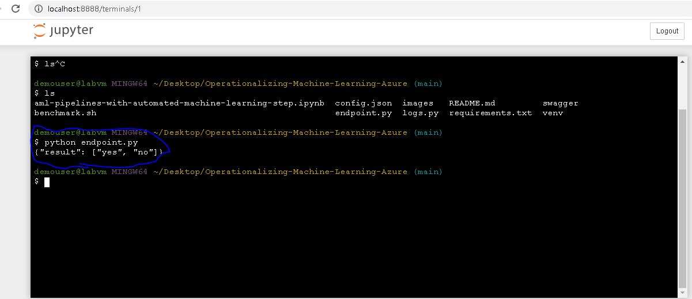
      
    - Benchmark the endpoint
      
      However, just getting working enpoint is not enough, Thus, we also have measure the time taken by enpoint to give the output. By doing this, we can ensure that our endpoint's performance for end-user.
4. Swagger Documentation
    
    At this point, we have our model endpoint is ready and consummable but we also have to document the endpoint so that the other developers can able to understand the usecase of the endpoint.
    
    Swagger document can be available in endpoint details section as a *swagger.json* file.
    
    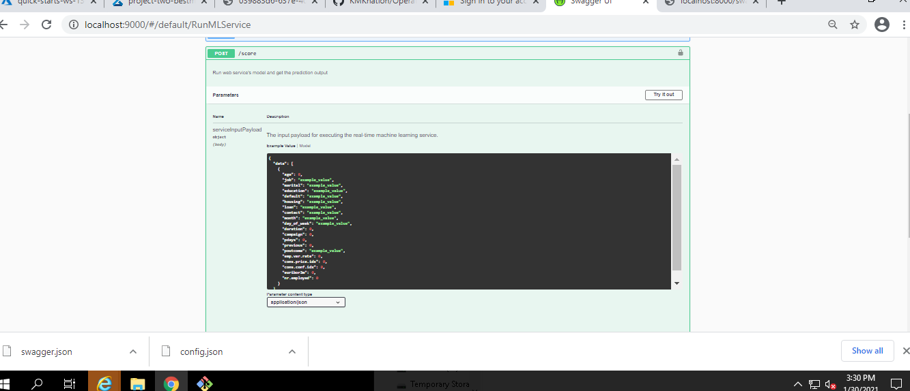
    
5. Pipeline Automation
    
    All the above steps, needs manual intervation for each thing. To automate above steps, Azure ML provides this pipeline option.
    
    In this pipeline, the developer have to create a python script or notebook with following steps.
    1. Create an Experiment in an existing Workspace.
    2. Create or Attach existing AmlCompute to a workspace.
    3. Define data loading in a TabularDataset.
    4. Configure AutoML using AutoMLConfig.
    5. Use AutoMLStep
    6. Train the model using AmlCompute
    7. Explore the results.
    8. Test the best fitted model.
    
    Through these above steps, we can also automate the MLOps pipeline through one script.
    
    Following are screenshout which we can see in Azure ML Studio.
    1. Pipeline Creation
    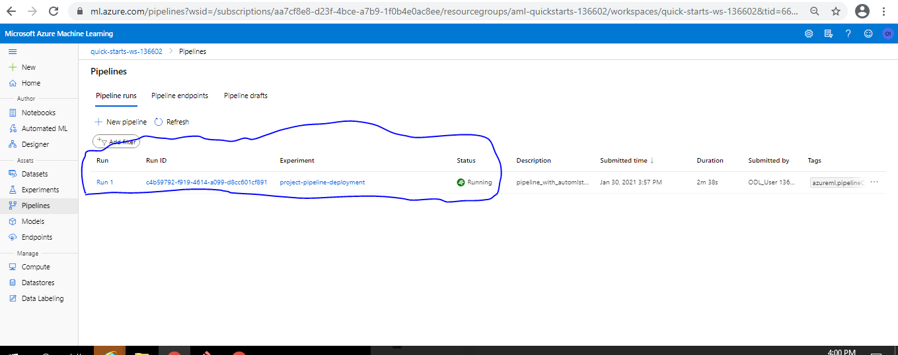

    2. Pipeline Runnning
    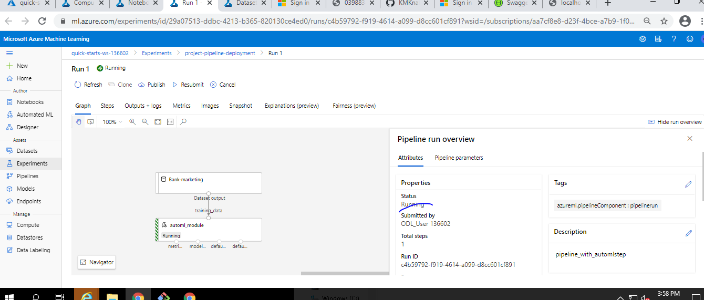

        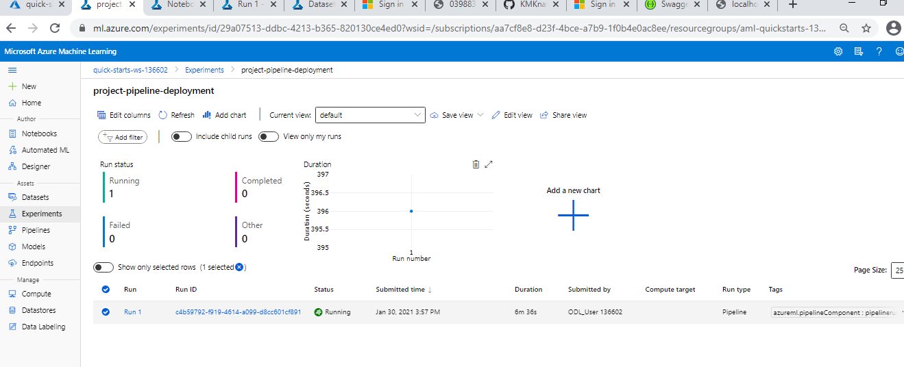
    
    3. Pipeline Complete
    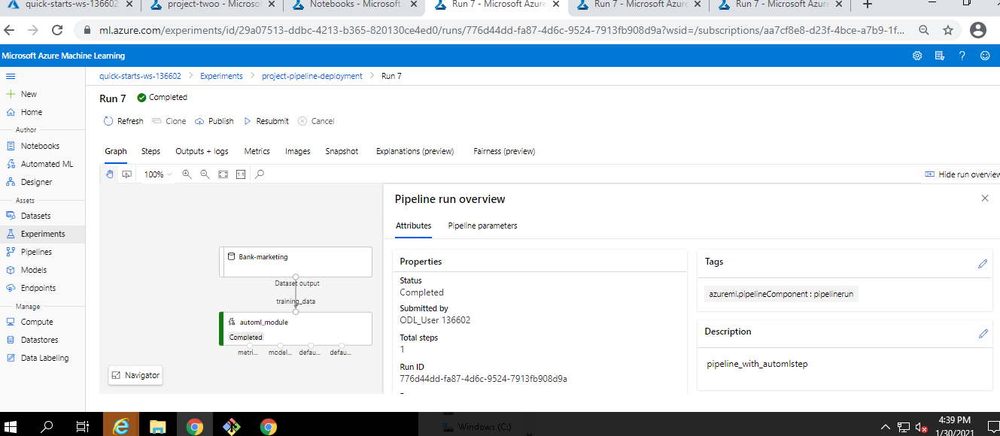

    4. Pipeline Run Log
    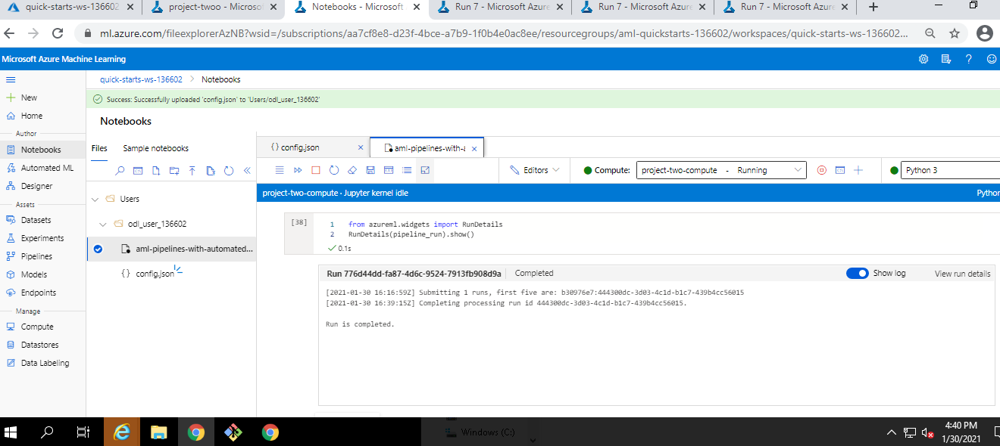

    5. Pipeline Endpoint Active
    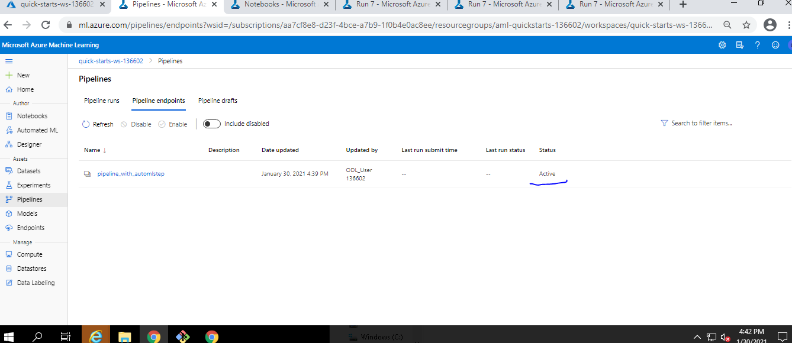
    
    6. Pipeline End Point URL
    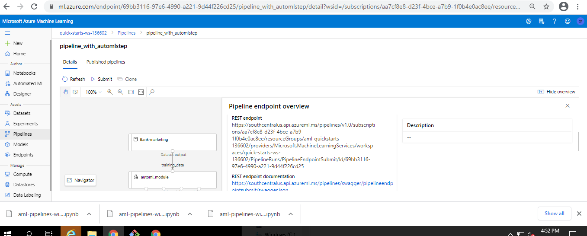
    
    7. Deallocate Compute Cluster
    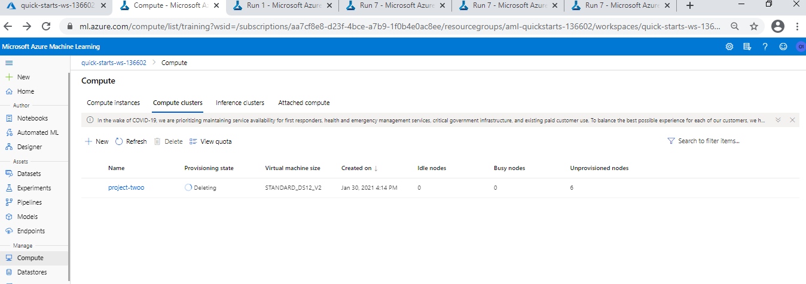

## Screen Recording
*TODO* Provide a link to a screen recording of the project in action. Remember that the screencast should demonstrate:

## Standout Suggestions
- There should be a option to set enable push notification on failure/suceess of the deployment/training process.
- There should also have one option allowing the developer to choose type of documentation to download. Like swagger or postman.
- It would be nice if we can automate the pipeline for CNN type algorithms.
